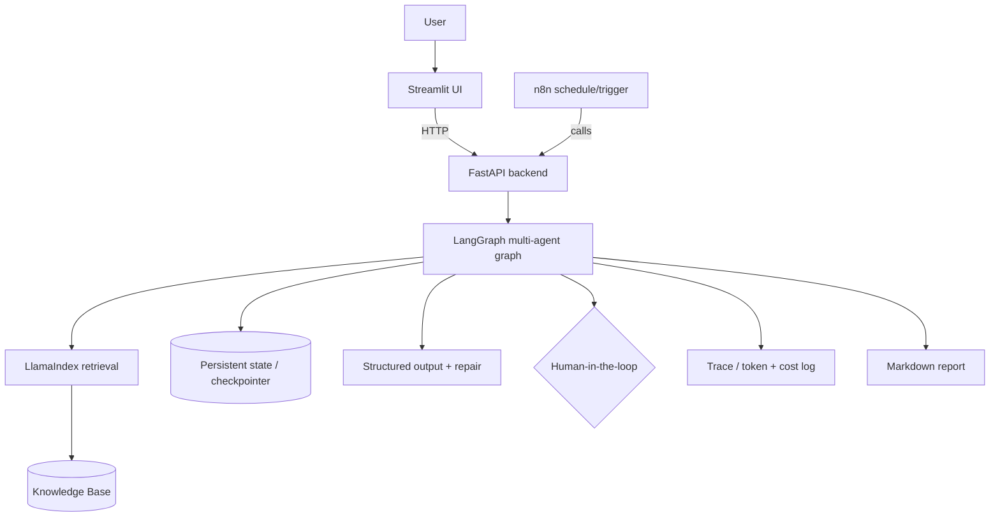

# Agentic AI — Graduation Projects (One Week, Teams of 5)
### Faculty of Computer and Information Sciences, Ain Shams University
**Program:** Agentic AI: Building Production-Ready Autonomous Systems (Kayfa)

---

## Read this first

**Every one of the 20 projects below is a full graduation project.** Each one must apply *everything* you learned across the 6 sessions and the 3 cross-cutting threads. The projects differ in their **problem and domain**, not in which concepts they use — the required concepts are the same for all of them because they are all the program's capstone.

If a concept was taught in the program, your project must demonstrate it. A project that only does RAG, or only does structured outputs, is **not** a graduation project and will be graded as incomplete.

---

## General Rules (apply to ALL projects)

| Rule | Requirement |
| --- | --- |
| Team size | Exactly **5 members** |
| Duration | **1 week** — scope realistically (see "One-week scoping" below) |
| Primary UI | **Streamlit app** (multiple pages allowed and encouraged) |
| Max project size | **50 MB total**, including all data and knowledge-base files |
| Data | Offline/local, public, synthetic, or self-created. **No personal/private data.** |
| Secrets | No API keys committed. Use `.env` (git-ignored) + provide `.env.example` |
| Dependencies | A working `requirements.txt` — the app must run from a clean install |

---

## The Graduation Standard — the full program stack, in EVERY project

Every project must implement the program's **mandatory five-layer architecture**:

| Layer | Required Tool | What it means in your project |
| --- | --- | --- |
| **Structured Outputs** | Pydantic (Pydantic AI) | Every model output is a validated schema, with a **repair loop** on failure. (Session 1) |
| **Knowledge / Retrieval** | LlamaIndex | A **measured** RAG layer over your knowledge base — not naive top-k. (Session 2) |
| **Agent Workflow** | LangGraph | A **multi-agent, stateful graph** with persistence and at least one **human-in-the-loop** interrupt. (Session 3) |
| **Interface** | Streamlit | A UI that **surfaces the agent's reasoning**, not just the final answer. (Session 4) |
| **API Backend** | FastAPI | The agent is served as an **async API** that the Streamlit UI calls. (Session 5) |
| **Automation** | n8n | An **automated workflow** (scheduled/triggered) around the agent. (Session 6) |

> **The "drop one" rule (from the program):** integrating all layers in one week is ambitious. A team **may drop ONE** of {n8n automation, the FastAPI/Streamlit split} **only if** they justify the cut in the README's framework write-up. A *defended* omission scores higher than a half-working component. You may **not** drop the agent, retrieval, structured-output, or evaluation layers.

### The three cross-cutting threads — also required in every project

- **Evaluation:** build an eval set and report **numbers** (retrieval metrics, schema-validity/repair rates, agent task-success/tool-call accuracy). Reliability is *measured*, never asserted.
- **Security & Adversarial Robustness:** **attack your own system** (prompt injection incl. *indirect* injection via a knowledge-base document, exfiltration, tool misuse), then defend it and report before/after.
- **Cost & Observability:** trace the pipeline, report a **token + latency budget per request**, and run your **TOON-vs-JSON benchmark on your own payload** with a real tokenizer.

---

## Required Core Features (every project)

Multi-agent workflow · stateful execution with persistence · knowledge retrieval · structured outputs · workflow automation · API integration · Markdown export.

## The Five Graduation Deliverables (in the README / `reports/`)

1. **Evaluation report with numbers** — eval set + metrics defending reliability.
2. **Failure-mode analysis** — where it breaks, why, and what you did.
3. **Security self-attack report** — your red-team attempts + the defenses you added.
4. **Cost & observability summary** — token/latency budget, a representative trace, and your **TOON-vs-JSON benchmark**.
5. **Framework-justification write-up** — the running comparison matrix: for each layer, what you chose and *why* (and what you rejected).

## Mandatory Repo Deliverables (every project)

1. **Streamlit app** (multi-page) that calls the **FastAPI** backend.
2. **README.md** containing:
   - Setup / run instructions.
   - **System architecture as Mermaid chart(s)** showing all layers and how data flows.
   - A **complete inventory of every file used as context / knowledge base** (name, format, size, source, purpose).
   - The five graduation deliverables above (inline or linked from `reports/`).

Example Mermaid skeleton (yours must reflect YOUR system, all layers):



---

## The Shared Graduation Rubric (100 points — used for EVERY project)

Every project is graded on the same skeleton, so the concept coverage is identical across teams. Each brief describes the **domain-specific** thing each row is testing.

| # | Criterion | Points |
| --- | --- | --- |
| **Core & hygiene (24)** | | |
| 1 | Working, stable Streamlit app that surfaces agent reasoning | 10 |
| 2 | README: Mermaid architecture of **all** layers + complete knowledge-base file inventory | 8 |
| 3 | Code quality + follows the recommended structure | 6 |
| **Program stack applied to the domain (42)** | | |
| 4 | Structured outputs: Pydantic schema + working repair loop | 8 |
| 5 | Knowledge retrieval with LlamaIndex, **measured** (recall@k / MRR / faithfulness) | 10 |
| 6 | LangGraph multi-agent workflow + persistent state + human-in-the-loop interrupt | 12 |
| 7 | FastAPI backend the UI calls (async, validated; streaming/auth a plus) | 8 |
| 8 | n8n automation (scheduled/triggered) **or** a defended cut per the "drop one" rule | 4 |
| **Cross-cutting rigor (28)** | | |
| 9 | Evaluation report with numbers (task success + reliability) | 8 |
| 10 | Security self-attack report (incl. **indirect** injection) + defenses, before/after | 8 |
| 11 | Cost & observability + **TOON-vs-JSON benchmark** on your own payload | 6 |
| 12 | Framework-justification write-up (comparison matrix) | 4 |
| 13 | Failure-mode analysis | 2 |
| **Demo (6)** | | |
| 14 | Live demo & Q&A | 6 |

**Penalties:** exceeding 50 MB, committed secrets, or an app that does not start = up to **−15 points** each.

---

## Recommended Project Structure (shared skeleton — every project)

```
project/
├── app/                      # Streamlit UI (calls the API)
│   ├── Home.py
│   └── pages/                # reasoning stream, evaluation, security, cost pages
├── api/                      # FastAPI backend
│   ├── main.py
│   └── routes.py
├── src/
│   ├── schemas.py            # Pydantic models (Session 1)
│   ├── retrieval/            # LlamaIndex ingest/index/retrieve (Session 2)
│   ├── agent/                # LangGraph graph, nodes, state, persistence (Session 3)
│   ├── security/             # guards + red-team runner (Session 6)
│   ├── observability/        # tracing, token/cost, TOON benchmark
│   └── evals/                # metrics harness
├── automation/
│   └── workflow.json         # exported n8n workflow (or documented alternative)
├── data/
│   ├── knowledge_base/       # all context files (listed in README)
│   └── eval/                 # gold/eval sets
├── reports/                  # the 5 graduation deliverables
├── README.md
├── requirements.txt
└── .env.example
```

Each brief repeats this with its **domain-specific data** and node names.

---

## One-week scoping (read this before you panic)

Build a **thin vertical slice first**: one working path through all layers (UI → API → agent → retrieval → structured output → Markdown), then deepen. It is far better to have every layer working modestly and **measured**, plus honest reports, than one flashy layer and four broken ones. Remember the "drop one" rule and *defend* any cut.

Suggested week:
- **Day 1:** dataset + schema + architecture agreed; roles split across the 5 layers.
- **Days 2–3:** retrieval + structured outputs + LangGraph graph working end to end behind FastAPI.
- **Day 4:** Streamlit UI on top; n8n automation; persistence + HITL.
- **Day 5:** evaluation harness + numbers; security self-attack; cost/TOON benchmark.
- **Day 6:** README (Mermaid + file inventory + 5 reports); bug-fixing.
- **Day 7:** demo dry-run; final rubric check.

## The 20 Projects (all are full graduation projects; the domain is what differs)

| # | Project | Domain the stack is applied to |
| --- | --- | --- |
| 01 | Campus Regulations Advisor | University rules & student-affairs Q&A |
| 02 | Smart CV Screener | Recruitment / candidate shortlisting |
| 03 | Exam Question Generator | Teaching / assessment creation |
| 04 | Study Plan Builder | Student learning planning |
| 05 | Support Ticket Triage System | Customer support operations |
| 06 | Secure Document Intelligence | Enterprise doc Q&A (security-forward) |
| 07 | Financial Report Analyst | Finance / filings analysis |
| 08 | Meeting Intelligence System | Productivity / meeting minutes |
| 09 | Healthcare Guidelines Assistant | Clinical guideline lookup (educational) |
| 10 | Legal Contract Reviewer | Contracts / clause analysis |
| 11 | Research Literature Assistant | Academic research briefs |
| 12 | E-commerce Catalog Assistant | Retail product discovery |
| 13 | Internal Helpdesk / Email Agent | IT/HR helpdesk automation |
| 14 | Course Advisor | Academic advising / course selection |
| 15 | Customer Feedback Intelligence | Product analytics from reviews |
| 16 | Content Approval Pipeline | Marketing / editorial workflow |
| 17 | Compliance & Policy Checker | Governance / policy conformance |
| 18 | Interview Prep Coach | Career coaching |
| 19 | Real-Estate / Listings Advisor | Property search & recommendation |
| 20 | News & Announcements Digest | Information monitoring & digests |

Each project has its own brief: `NN_Project_Title.md`. **No two projects share the same domain or the same domain-specific task list** — but all apply the identical program stack. This is a **defensive/educational** program: all security work is on **your own sandboxed system only**.
