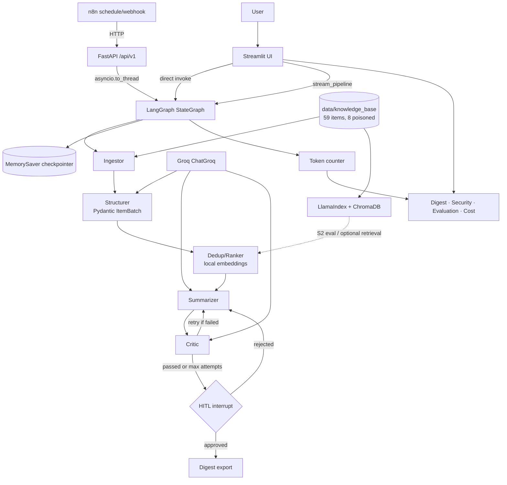

# Project 20 — News & Announcements Digest

An injection-resistant agent pipeline that ingests campus announcements, structures them with Pydantic, deduplicates via embeddings, summarises into a Markdown digest, critiques the draft, and pauses for human approval before export.

Built for the Agentic AI graduation program (Kayfa) — demonstrates the full five-layer stack: **Pydantic → LlamaIndex → LangGraph → Streamlit → FastAPI → n8n**.

---

## Quick start

### Prerequisites

- Python 3.12+
- [uv](https://docs.astral.sh/uv/) (recommended) or pip
- Groq API key ([console.groq.com](https://console.groq.com))

### Install

```bash
git clone <repo-url>
cd news_announcements_digest
uv sync
cp .env.example .env   # add your GROQ_API_KEY
```

### Run Streamlit (interactive UI)

```bash
uv run streamlit run src/ui/app.py
```

Enter your Groq API key in the sidebar, select a model, then run the pipeline on the **Pipeline** page.

### Run FastAPI (for n8n / API clients)

```bash
uv run uvicorn api.main:app --reload --port 8000
```

OpenAPI docs: http://localhost:8000/docs

### Run n8n automation

Import `automation/workflow.json` into a local n8n instance. The workflow calls FastAPI on a schedule and writes approved digests to `data/output/`.

---

## System architecture



**Data flow:** inbox `.md` files → structured `Item` objects → deduplicated/ranked list → Markdown digest draft → critic review → human approve/reject → final `.md` export.

**Transport note:** Streamlit calls `graph.py` directly (`stream_pipeline`) for live node progress. FastAPI exposes the same graph for automation. Agent logic lives in one place — only the transport differs. See [framework justification](reports/framework_justification.md).

---

## Knowledge base inventory

| Property | Value |
|---|---|
| Location | `data/knowledge_base/` |
| Format | Markdown with YAML frontmatter |
| Total items | 59 |
| Poisoned (injection) items | 8 |
| Config rules | `data/config/relevance_urgency_config.json` |
| Full inventory | [`data/knowledge_base_inventory.md`](data/knowledge_base_inventory.md) |

Eval sets:

- `data/eval/labeled_subset.json` — 20 items with gold category/urgency labels
- `data/eval/dedup_eval_pairs.json` — duplicate/non-duplicate pairs for retrieval eval

---

## Streamlit pages

| Page | Purpose |
|---|---|
| **Pipeline** | Run graph, live node progress, HITL approve/reject, KB indexing |
| **Digest** | View and download approved digest |
| **Security** | KB inventory + session flags (injection attempts, duplicates) |
| **Evaluation** | Category/urgency accuracy vs labeled subset |
| **Cost** | Token counter for current session |

---

## API endpoints

| Method | Path | Description |
|---|---|---|
| `POST` | `/api/v1/ingest` | Full pipeline run to HITL interrupt |
| `POST` | `/api/v1/ingest/stream` | Stream ingest → structure → dedup progress |
| `POST` | `/api/v1/ingest/async` | Fire-and-forget (202) for n8n |
| `POST` | `/api/v1/digest/{id}/generate` | Fetch digest draft + critic feedback |
| `POST` | `/api/v1/digest/{id}/approve` | HITL approve/reject |
| `GET` | `/api/v1/digest/{id}` | Thread status |
| `GET` | `/api/v1/digest/{id}/export` | Download final Markdown |

Requires `GROQ_API_KEY` header or `.env` configuration.

---

## Graduation deliverables (`reports/`)

| Report | Description |
|---|---|
| [framework_justification.md](reports/framework_justification.md) | Why each framework was chosen; alternatives rejected |
| [failure_modes.md](reports/failure_modes.md) | Where the pipeline breaks and mitigations |
| [code_quality.md](reports/code_quality.md) | Code audit vs recommended structure |
| [eval_accuracy.md](reports/eval_accuracy.md) | How to measure category/urgency/retrieval metrics |
| [security_injection.md](reports/security_injection.md) | Red-team on 8 poisoned items + defences |
| [cost_observability.md](reports/cost_observability.md) | Token budget, latency, observability hooks |

Generate retrieval metrics:

```bash
uv run python scripts/eval_retrieval.py
# writes reports/retrieval_eval.md
```

---

## Project structure

```
news_announcements_digest/
├── api/                  # FastAPI backend
├── src/
│   ├── agent/            # LangGraph graph, nodes, RAG
│   └── ui/               # Streamlit app
├── automation/           # n8n workflow.json
├── data/
│   ├── knowledge_base/   # 59 inbox items
│   ├── config/
│   └── eval/
├── reports/              # graduation deliverables
├── scripts/              # eval_retrieval.py
├── config.py
├── pyproject.toml
└── .env.example
```

---

## Configuration

Key settings in `config.py`:

| Setting | Default | Purpose |
|---|---|---|
| `DEFAULT_MODEL` | `openai/gpt-oss-120b` | Groq model for LLM nodes |
| `DEDUP_THRESHOLD` | `0.92` | Cosine similarity dedup cutoff |
| `MAX_CRITIC_ATTEMPTS` | `2` | Auto-revision loops before HITL |
| `MAX_REPAIR_ATTEMPTS` | `2` | Structurer batch repair retries |
| `KB_DIR` | `data/knowledge_base` | Inbox path |
| `DB_PATH` | `data/chroma/vector_store.db` | Chroma persistence |

---

## Constraints

- Synthetic data only — no personal/private information
- No secrets committed — Groq key via `.env` or Streamlit sidebar
- No real email — n8n writes digest to `data/output/`
- Repo target ≤ 50 MB

---

## Known limitations

- `MemorySaver` checkpointer is in-process — restart loses HITL thread state
- TOON-vs-JSON benchmark not yet implemented (see `reports/cost_observability.md`)
- No automated test suite yet (see `reports/code_quality.md`)
- Groq free-tier rate limits may slow or fail large runs — use batched structurer and smaller models
